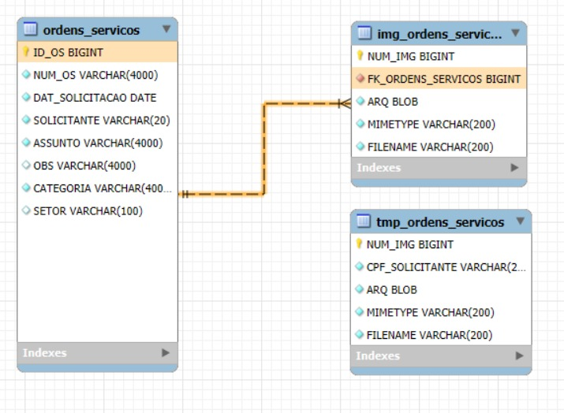

	<h1>BANCO DE DADOS</h1>

Descrição: documentação das tabelas do banco de dados do COS.

---

## 📖 Índice

- [Visão Geral](#-visão-geral)
- [Tabelas](#-tabelas)
- [Modelagem física](#️-modelagem-física)

---

## 🔎 Visão Geral

O banco de dados do COS conta com 3 tabelas principais: ordens_servicos, img_ordens_servicos e tmp_ordens_servicos.

## 🗂 Tabelas

- [ordens_servicos](ordens_servicos/README.md) - tabela central das ordens de serviço
- [img_ordens_servicos](img_ordens_servicos/README.md) - imagens relacionadas às ordens de serviço
- [tmp_ordens_servicos](tmp_ordens_servicos/README.md) - imagens temporárias antes da criação da OS

## 🗺️ Modelagem física

O diagrama físico do banco de dados mostra tabelas, chaves primárias e relacionamentos usados em produção. Utilize o diagrama para entender cardinalidades, dependências e caminhos de consulta.

  

*Arquivo: `banco_de_dados/Modelo_Fisico.jpeg`.*

---

Voltar para: [documentação principal](../README.md)
